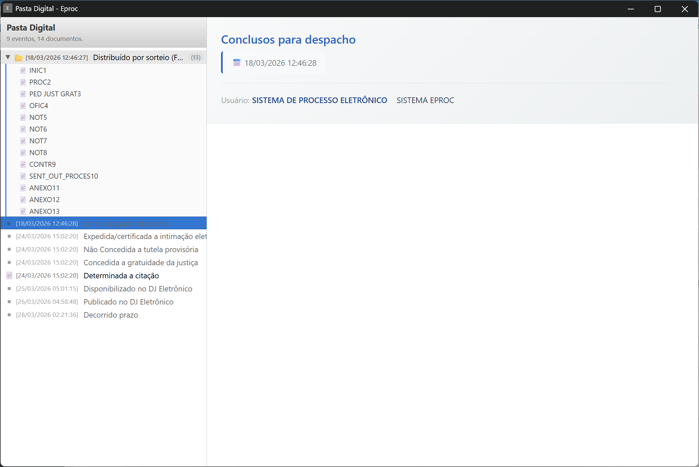

<div align="center">


# Eproc Pasta Digital

**Visualize todos os documentos do processo em ordem cronológica, direto no eProc.**

[](LICENSE)


</div>

---

## O que é

O eProc exibe os eventos de um processo em uma tabela paginada, sem agrupamento ou ordem cronológica clara. A **Eproc Pasta Digital** resolve isso: com um clique, coleta todos os eventos de todas as páginas e apresenta uma linha do tempo navegável — semelhante à Pasta Digital do eSAJ.

<div align="center">
  
</div>

---

## Funcionalidades

| | |
|---|---|
| **Linha do tempo cronológica** | Eventos ordenados do mais antigo ao mais recente, coletados de todas as páginas automaticamente |
| **Visualização inline** | Documentos PDF abrem direto na janela, sem nova aba |
| **Áudios de audiência** | Player integrado com botão de download |
| **Múltiplos documentos** | Eventos com vários documentos agrupados em pastas expansíveis |
| **Metadados extraídos** | Magistrado, usuário, status de prazo, advogados com OAB |

---

## Compatibilidade

Funciona em qualquer tribunal que utilize o sistema **eProc** — todos compartilham a mesma interface e estrutura de dados.

> Testou em um tribunal e não funcionou? Abra uma [issue](../../issues) ou contribua com um PR para ampliar o suporte.

---

## Instalação

### Chrome Web Store *(em breve)*

### Manual

1. Baixe o [último release](../../releases/latest) (`eproc-pasta-digital.zip`)
2. Abra `chrome://extensions` no Chrome
3. Ative o **Modo do desenvolvedor** (canto superior direito)
4. Clique em **Carregar sem compactação** e selecione a pasta extraída

---

## Como usar

1. Abra qualquer processo no eProc
2. Clique no botão **📂 Pasta Digital** na barra de comandos
3. Aguarde o carregamento — a extensão busca todas as páginas automaticamente
4. Navegue pelos eventos na barra lateral e clique para visualizar cada documento

---

## Desenvolvimento

```bash
git clone https://github.com/ArthurCarrenho/extensao-eproc
cd extensao-eproc
npm install
npm run dev       # build com watch
npm run build     # build de produção
npm run icons     # regenera os ícones PNG a partir do SVG
```

### Estrutura

```
src/
├── background.js        # service worker — abre a janela popup
├── content.js           # injetado na página do processo
├── parser.js            # extrai eventos do DOM do eProc
├── api.js               # busca páginas paginadas via fetch
├── utils.js             # utilitários compartilhados
├── pasta_ui.js          # lógica da janela Pasta Digital
├── formatter.js         # renderiza o layout de cada evento
├── pasta_window.html    # HTML da janela Pasta Digital
├── icons/               # ícones da extensão
└── templates/           # layouts HTML dos documentos
```

---

## Privacidade

A extensão **não coleta, transmite nem armazena** nenhum dado fora do seu navegador. Os dados do processo ficam exclusivamente no armazenamento local do Chrome e são descartados ao fechar a janela.

---

## Contribuindo

Contribuições são bem-vindas — especialmente para novos tribunais, melhorias no parser ou correções de layout.

1. Fork o projeto
2. Crie uma branch (`git checkout -b minha-melhoria`)
3. Commit suas mudanças (`git commit -m 'Descrição clara da mudança'`)
4. Abra um Pull Request

---

## Licença

Distribuído sob a licença **AGPLv3**. Veja [LICENSE](LICENSE) para mais detalhes.
